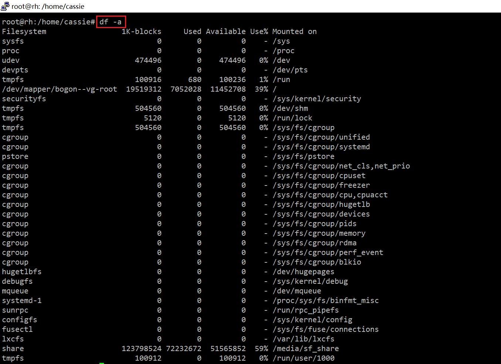
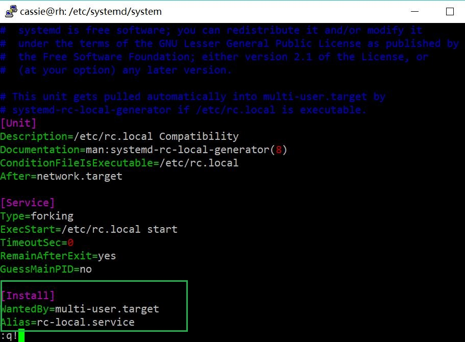

## 实验三
### 实验概述
- 学习Systemd入门教程
- 使用asciinema记录学习过程
- 完成自查清单

### 实验过程
[systemd——系统管理](https://asciinema.org/a/KIdGX5Aq69ujpHeg17aqmiWJb)

[systemd——Unit](https://asciinema.org/a/rlvh1lwTX3CM8iLRx69yQyrJh)

[systemd——Unit的配置文件](https://asciinema.org/a/kwTMYneG1qNxqtmk68PnQhs9W)

[systemd——Target](https://asciinema.org/a/UX23CFhwYYc28pM37YUhagt8n)

[systemd——日志管理](https://asciinema.org/a/puLafHLoLmCWLtEKtq3WHgfMv)

[systemd——实战](https://asciinema.org/a/GkP4Zp7OZ1QlrupmyKD3m2Qgn)

### 自查清单
**如何添加一个用户并使其具备sudo执行程序的权限？**
```bash
# 添加新用户hello
sudo adduser hello

# 进入root
su root

# 编辑sudo配置文件
vim /etc/sudoers

# 找到“root ALL=(ALL:ALL) ALL”
# 在下一行添加以下内容
hello ALL=(ALL:ALL) ALL
```


**如何将一个用户添加到一个用户组？**
```bash
# 进入root权限
su root

# 添加新用户组grp1
groupadd grp1

# 将用户hello添加到用户组grp1中
# -a使用户添加到新的用户组中，并使其不离开其他用户组
usermod -a -G grp1 hello

# 检验用户hello所在的用户组
groups hello
```


**如何查看当前系统的分区表和文件系统详细信息？**
```bash
# 查看当前系统的分区表
sudo fdisk -l

# 查看文件系统详细信息
df -a
```




**如何实现开机自动挂载Virtualbox的共享目录分区？**
```bash
# 先进行手动设置
# 新建ubuntu的共享文件夹shared
mkdir ~/shared

# 挂载共享文件夹
sudo mount -t vboxsf share ~/shared

# 利用systemd设置开机自动挂载
# 链接/lib/systemd/system/下的rc-local.service文件
ln -fs /lib/systemd/system/rc-local.service /etc/systemd/system/rc-local.service 

cd /etc/systemd/system/  
cat rc-local.service  

# 在 rc-local.service中添加以下内容
[Install]  
WantedBy=multi-user.target  
Alias=rc-local.service  

# 创建/etc/rc.local文件
touch /etc/rc.local 

# 更改权限，使其拥有可执行权限
chmod 755 /etc/rc.local

# 编辑rc.local，添加需要开机启动的任务，即自动挂载
mount -t vboxsf share ~/shared
```




**基于LVM（逻辑分卷管理）的分区如何实现动态扩容和缩减容量？**
```bash
# 扩容
lvextend --size +1024m /dev/bogon-vg/root

# 缩容
lvreduce --size -1024m /dev/bogon-vg/root
```

**如何通过systemd设置实现在网络连通时运行一个指定脚本，在网络断开时运行另一个脚本？**
```bash
# 修改NetworkManager.service配置文件的Service区块
# 网络连通时运行a.service
ExecStartPost = a.service

# 网络断开时运行b.service
ExecStopPost = b.service
```

**如何通过systemd设置实现一个脚本在任何情况下被杀死之后会立即重新启动？实现杀不死？**
- 修改Unit文件中Service区块的Restart内容：定义服务何种情况下重启（启动失败，启动超时，进程被终结）。可选选项：no，on-success，on-failure，on-watchdog，on-abort
### 实验问题
1. 在挂载共享文件夹，执行```sudo mount -t vboxsf share ~/shared```时，出现```"wrong fs type,bad option,bad superblock..."```错误，后发现是未安装增强功能导致，可以通过执行以下命令解决：
```bash
sudo apt install nfs-common
sudo apt install cifs-utils
sudo apt install virtualbox-guest-utils
```
2. 由于在ubuntu18.04中的```etc```文件夹下未找到旧版本拥有的```rc.local```文件，需要使用systemd设置开机启动，经历了如上操作，但最终还是没有实现自动挂载。猜测可能是因为在```rc.local```文件中添加的命令，只能自动执行Unit文件，而不能执行某个操作，如挂载文件夹。
### 参考链接
- [Systemd 入门教程：命令篇](http://www.ruanyifeng.com/blog/2016/03/systemd-tutorial-commands.html)
- [Systemd 入门教程：实战篇](http://www.ruanyifeng.com/blog/2016/03/systemd-tutorial-part-two.html)
- [VMBox挂载共享文件时可能出现的问题以及对应的解决办法](https://blog.csdn.net/l349074299/article/details/77869317)
- [virtualbox共享文件夹设置及开机自启动配置](https://www.cnblogs.com/it-book/p/9278758.html)
- [Ubuntu 18.04 rc.local systemd设置](https://www.centos.bz/2018/05/ubuntu-18-04-rc-local-systemd%E8%AE%BE%E7%BD%AE/)