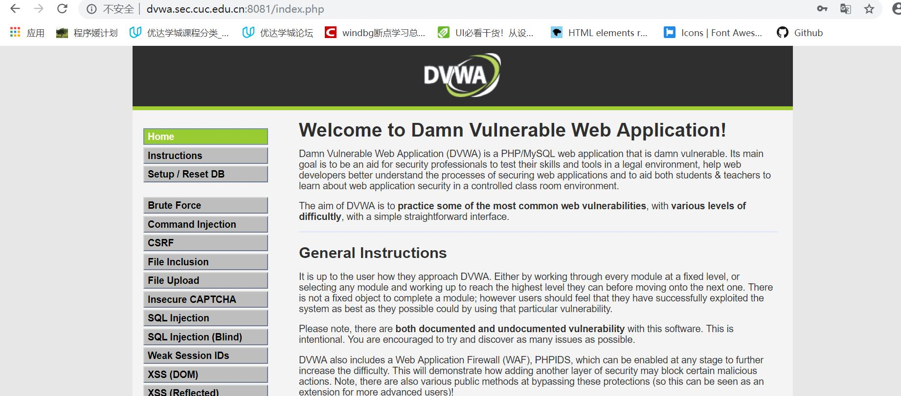
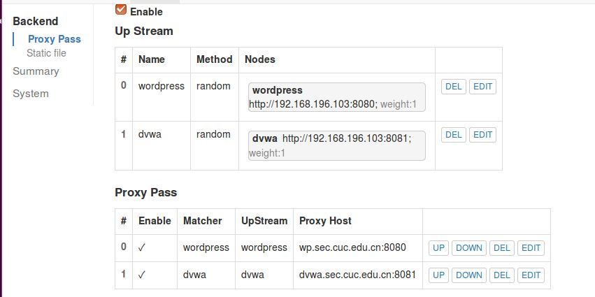
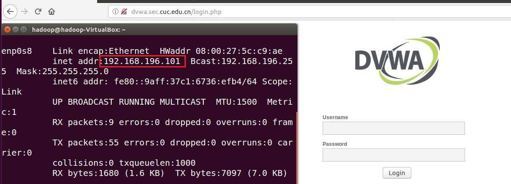
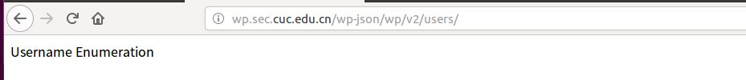

## 实验五
### 实验环境

**UbuntuServer：**
- Ubuntu16.04
- Nginx（Port：8080/8081）
- VeryNginx（Port：80）
- Wordpress（IP：192.168.196.103；Port：8080）
- DVWA（IP：192.168.196.103；Port：8081）

**UbuntuClient：**
- Ubuntu16.04（IP：192.168.196.101）

### 安装配置VeryNginx与Nginx
```bash
# 安装git
sudo apt install git

# 安装Ngix
sudo apt install nginx

# 安装VeryNginx
git clone https://github.com/alexazhou/VeryNginx.git
sudo apt install libssl-dev libpcre3 libpcre3-dev build-essential
cd VeryNginx
sudo python install.py install

# 添加用户nginx
# 若不添加nginx用户则会有如下报错，因为VeryNginx/nginx.conf文件中第一行的内容为"user nginx;"
sudo adduser nginx
```


```bash
# 启动VeryNginx服务，出现如下错误
sudo /opt/verynginx/openresty/nginx/sbin/nginx
```


此时Nginx与VeryNginx都占用80端口，导致无法正常开启服务，因此要先杀死Nginx进程以便开启VeryNginx服务。

```bash
# 显示Nginx进程信息，程序ID为6625
ps -ef | grep nginx

# kill
sudo kill -QUIT 6625
```


再次开启VeryNginx服务，成功。


为了能够同时开启Nginx和VeryNginx，可以将Nginx的端口改为8080

```bash
# 修改配置文件，将端口号改为8080
sudo vim /etc/nginx/sites-available/default
```


```bash
# 开启Nginx
sudo service nginx start
```


### 使用Wordpress搭建站点

在Ubuntu中安装mysql，并为搭建Wordpress做配置：

```bash
# 登录mysql的root账户
mysql -u root -p

# 创建wordpress数据库
CREATE DATABASE wordpress DEFAULT CHARACTER SET utf8 COLLATE utf8_unicode_ci;

# 创建wordpressuser账户，授予访问权限并设置密码
GRANT ALL ON wordpress.* TO 'wordpressuser'@'localhost' IDENTIFIED BY 'password';

# 刷新权限
FLUSH PRIVILEGES;

# 退出mysql
EXIT;
```

在Ubuntu中安装php7.0：

```bash 
# 安装php7.0
sudo apt install php7.0

# 安装一些php扩展
sudo apt install php-curl php-gd php-mbstring php-mcrypt php-xml php-xmlrpc

# 重新启动php-fpm进程
sudo systemctl restart php7.0-fpm
```

在Ubuntu中安装并配置WordPress：

```bash
# 在一个可写目录下安装WordPress
cd /tmp
curl -O https://wordpress.org/latest.tar.gz

# 解压文件以创建WordPress目录结构
tar xzvf latest.tar.gz

# 将示例配置文件复制到WordPress实际读取的文件中
cp /tmp/wordpress/wp-config-sample.php /tmp/wordpress/wp-config.php

# 将目录的全部内容复制到文档根目录中
# -a标志用来维护权限
sudo cp -a /tmp/wordpress/. /var/www/html

# 赋予/var/www/html可执行权限
# 否则不会进入WordPress的index.php页面
sudo chmod -R 777 /var/www/html

# 从WordPress密钥生成器中获取安全值
curl -s https://api.wordpress.org/secret-key/1.1/salt/
```

将生成的内容复制到```/var/www/html/wp-config.php```中，并修改数据库的设置，如下图


在浏览器中访问ip地址，即可完成WordPress的安装


实现WordPress的域名访问

```bash
# 在Ubuntu中，修改/etc/nginx/sites-available/default的server_name
server_name wp.sec.cuc.edu.cn;

# 重启Nginx以应用配置
sudo systemctl restart nginx

# 在/etc/hosts中添加
192.168.196.103 wp.sec.cuc.edu.cn

# 在本机C:\Windows\System32\drivers\etc\hosts中添加同样的内容
# 需要管理员权限
192.168.196.103 wp.sec.cuc.edu.cn
```

在本机中通过域名访问成功：


### 使用DVWA搭建站点

首先为Nginx开启8081端口。在```/etc/nginx/sites-available/default```中增加以下内容并保存：


```bash
# 安装DVWA
sudo git clone https://github.com/ethicalhack3r/DVWA
# 把下载的文件放入/var/www/html/文件夹下
sudo cp -a /home/DVWA/. /var/www/html/DVWA
```

将```DVWA/config/config.inc.php.dist```文件去掉后缀```.dist```，访问ip地址，进入安装页面


在```/var/www/html/DVWA/config/config.ini.php```中修改数据库信息。

根据首页的提示，更改红色的选项至其变成绿色，表示可安装。以下为此次安装中遇到的问题：

```bash
# PHP module gd:Uninstalled
# 解决方法：安装php的gd模块
sudo apt install php7.0-gd

# PHP function allow_url_include:Disabled
# 解决方法：找到php.ini并将allow_url_include的值改为1
# 后来发现可以忽略这条报错
allow_url_include = 1

# 最终显示无法连接到mysql数据库
# 在/etc/mysql/mysql.conf.d/mysqld.cnf中将bind-address = 127.0.0.1注释掉
# 还是无法连接到mysql数据库
# 经过各种排查发现是创建数据库用户授权时出了问题
# 原语句为：GRANT ALL ON dvwa.* TO 'dvwauser'@'localhost' IDENTIFIED BY 'password';
# 更改为：
GRANT ALL PRIVILEGES ON dvwa.* TO dvwauser@"%" IDENTIFIED BY 'password';
# 原因：localhost表示只有主机可以连接，而%表示任何客户机都可以连接
```

成功安装DVWA，并重复之前的操作，实现在本机域名访问DVWA：



### 反向代理
在VeryNginx中作以下配置：




### 安全加固要求
**使用IP地址方式均无法访问上述任意站点，并向访客展示自定义的友好错误提示信息页面-1**

Matcher：


Response：


Filter：


测试结果：


**Damn Vulnerable Web Application (DVWA)只允许白名单上的访客来源IP，其他来源的IP访问均向访客展示自定义的友好错误提示信息页面-2**

将UbuntuClient（IP：192.168.196.101）加入白名单

Filter：


白名单中的IP可以访问DVWA：



其他IP无法访问DVWA:


**在不升级Wordpress版本的情况下，通过定制VeryNginx的访问控制策略规则，热修复WordPress < 4.7.1 - Username Enumeration**

Matcher：


Response：


Filter：


在UbuntuClient的测试结果：



**通过配置VeryNginx的Filter规则实现对Damn Vulnerable Web Application (DVWA)的SQL注入实验在低安全等级条件下进行防护**

Matcher：


Response：


Filter：


在UbuntuClient的测试结果：


### VeryNginx配置要求
**VeryNginx的Web管理页面仅允许白名单上的访客来源IP，其他来源的IP访问均向访客展示自定义的友好错误提示信息页面-3**

白名单中的IP可以访问VeryNginx：


其他IP无法访问VeryNginx：


**限制DVWA站点的单IP访问速率为每秒请求数 < 50，限制Wordpress站点的单IP访问速率为每秒请求数 < 20，超过访问频率限制的请求直接返回自定义错误提示信息页面-4**


**禁止curl访问**

Matcher：


Response：


Filter：


在UbuntuClient的测试结果：


### 实验心得
在此次安装过程中踩了许多的坑，虽然很崩溃，但好在最后坚持下来了，并作出以下总结：
- 要有遇到困难不放弃的钻研精神
- 有时会存在睡一觉后醒来再打开虚拟机就可以解决的玄学问题
- 最重要的是，虚拟机一定要及时备份！！！


### 参考链接
- [2015-linux-public-ghan3](https://github.com/CUCCS/2015-linux-public-ghan3/blob/90008489e97863626f6f72e1c87e589e79141419/%E7%AC%AC%E4%BA%94%E6%AC%A1%E5%AE%9E%E9%AA%8C/hw5.md)
- [How To Install WordPress with LAMP on Ubuntu 16.04](https://www.digitalocean.com/community/tutorials/how-to-install-wordpress-with-lamp-on-ubuntu-16-04#step-1-create-a-mysql-database-and-user-for-wordpress)
- [How To Install Linux, Nginx, MySQL, PHP (LEMP stack) in Ubuntu 16.04](https://www.digitalocean.com/community/tutorials/how-to-install-linux-nginx-mysql-php-lemp-stack-in-ubuntu-16-04#step-2-install-mysql-to-manage-site-data)
- [mysql配置可以远程访问 ](https://blog.51cto.com/9153232/2177401)