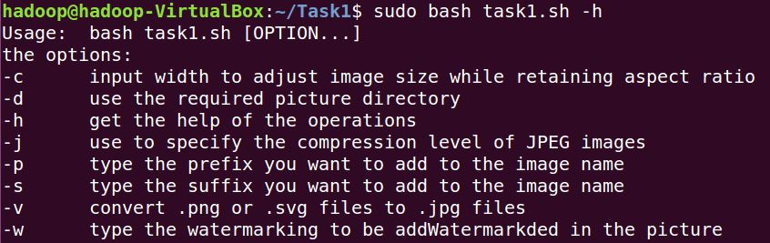
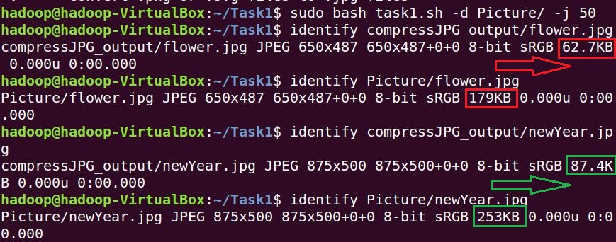
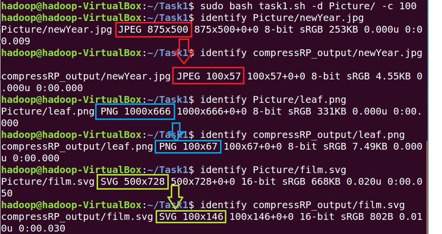
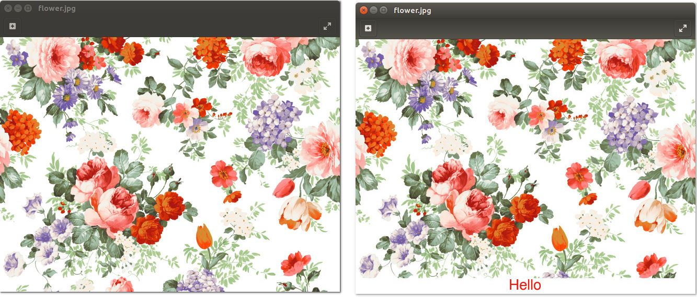
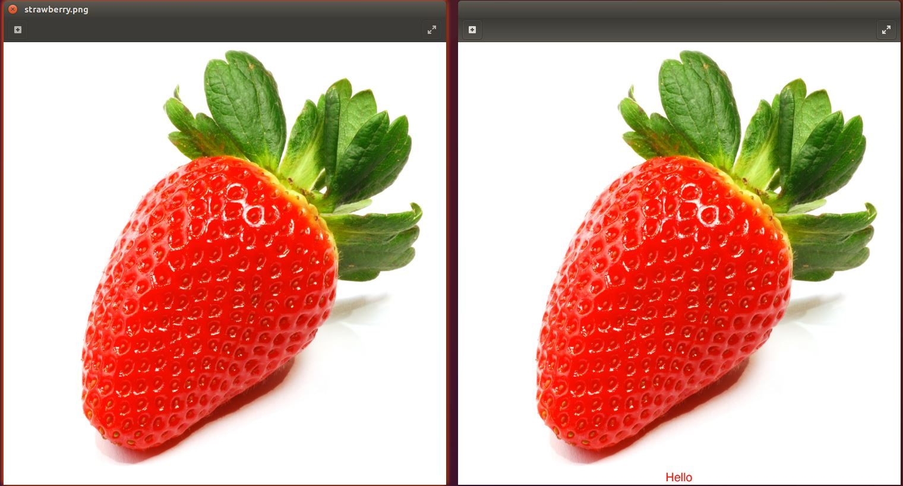
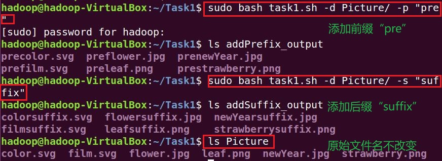
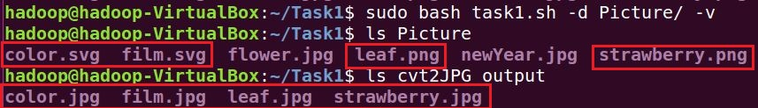
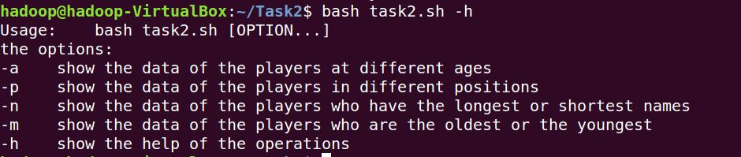
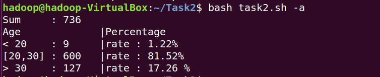
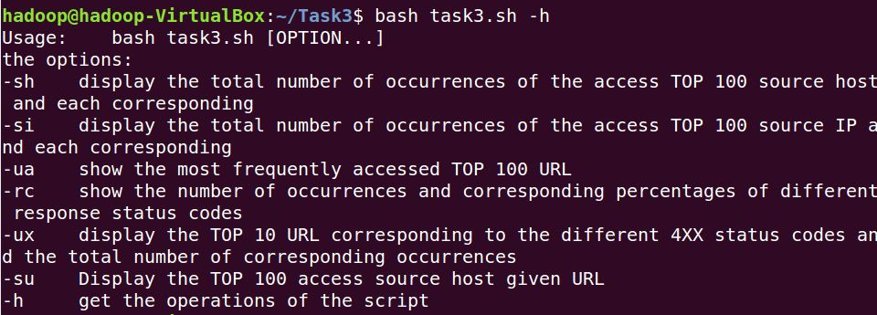

## 实验四
### 任务一：用bash编写一个图片批处理脚本
**代码：[task1.sh](Code/task1.sh)**

可以使用convert命令转换图像的格式，支持JPG，BMP，PCX，GIF，PNG，TIFF，XPM和XWD等类型。

```bash
# 支持命令行参数方式使用不同功能
# -h：表示help，即脚本内置的帮助信息
# 仿照man手册进行排版
sudo bash task1.sh -h
```



```bash
# 支持对jpeg格式图片进行图片质量压缩
# -d：进入Picture文件夹
# -j：指定JPEG图像质量压缩在百分级别的参数
# convert -quality：对图片进行质量压缩
sudo bash task1.sh -d Picture/ -j 50
```



```bash
# 支持对jpeg/png/svg格式图片在保持原始宽高比的前提下压缩分辨率
# -c：分辨率的压缩倍数
# 压缩100倍，即宽与高分别压缩10倍
# convert -resize：对图片进行缩放
sudo bash task1.sh -d Picture/ -c 100
```



```bash
# 支持对图片批量添加自定义文本水印
# -w：文本水印"Hello"
# convert -gravity center：从中心位置截取图片
sudo bash task1.sh -d Picture/ -w "Hello"
```





```bash
# 支持批量重命名（统一添加文件名前缀或后缀，不影响原始文件扩展名）
# 统一添加文件名前缀
sudo bash task1.sh -d Picture/ -p "pre"

# 统一添加文件名后缀
sudo bash task1.sh -d Picture/ -s "suffix"
```



```bash
# 支持将png/svg图片统一转换为jpg格式图片
# convert xxx.png xxx.jpg：将png转化为jpg
# convert xxx.svg xxx.jpg：将svg转化为jpg
sudo bash task1.sh -d Picture/ -v
```



### 任务二：用bash编写一个文本批处理脚本，对以下附件分别进行批量处理完成相应的数据统计任务
**代码：[task2.sh](Code/task2.sh)**

```bash
# 支持命令行参数方式使用不同功能
# -h：表示help，即脚本内置的帮助信息
bash task2.sh -h
```



```bash
# 统计不同年龄区间范围（20岁以下、[20-30]、30岁以上）的球员数量、百分比
# -a：调用脚本内置函数compareAge，显示不同年龄区间范围的球员数量、百分比
bash task2.sh -a
```



```bash
# 统计不同场上位置的球员数量、百分比
# -p：调用脚本内置函数showPositions，统计不同场上位置的球员数量、百分比
bash task2.sh -p
```


```bash
# 名字最长的球员是谁？名字最短的球员是谁？
# -n：调用脚本内置函数compareName
# 注意：长度为最值的名字可能有多个
bash task2.sh -n
```


```bash
# 年龄最大的球员是谁？年龄最小的球员是谁？
# -m：调用脚本内置函数showAges
# 注意：年龄为最值的球员可能有多个
bash task2.sh -m
```


### 任务三：用bash编写一个文本批处理脚本，对以下附件分别进行批量处理完成相应的数据统计任务
**代码：[task3.sh](Code/task3.sh)**

```bash
# 支持命令行参数方式使用不同功能
bash task3.sh -h
```



```bash
# 统计访问来源主机TOP 100和分别对应出现的总次数
bash task3.sh -sh
```

[hostTop100](Code/Task3Data/hostTop100.txt)

```bash
# 统计访问来源主机TOP 100 IP和分别对应出现的总次数
bash task3.sh -si
```

[ipTop100](Code/Task3Data/ipTop100.txt)

```bash
# 统计最频繁被访问的URL TOP 100
bash task3.sh -ua
```

[urlTop100](Code/Task3Data/urlTop100.txt)

```bash
# 统计不同响应状态码的出现次数和对应百分比
bash task3.sh -rc
```

[statusCode](Code/Task3Data/statusCode.txt)

```bash
# 分别统计不同4XX状态码对应的TOP 10 URL和对应出现的总次数
bash task3.sh -ux
```

[403Code](Code/Task3Data/403Code.txt)

[404Code](Code/Task3Data/404Code.txt)

```bash
# 给定URL输出TOP 100访问来源主机
bash task3.sh -su
```

[top100hostOfTheUrl](Code/Task3Data/top100hostOfTheUrl.txt)

### 参考链接
- [2015-linux-public-ghan3](https://github.com/CUCCS/2015-linux-public-ghan3/tree/660ea505f077bd636cb2169c3819fafd683fd51b/%E7%AC%AC%E5%9B%9B%E6%AC%A1%E5%AE%9E%E9%AA%8C)
- [强大的convert命令](http://www.linuxdiyf.com/viewarticle.php?id=170334)
- [convert命令常用图片操作](https://blog.csdn.net/u011944141/article/details/51658012)
- [Linux下采用shell脚本实现批量为指定文件夹下图片添加水印的方法](https://www.jb51.net/article/51888.htm)
- [使用shell脚本统计文件中ip出现的次数](https://blog.csdn.net/xiamoyanyulrq/article/details/81570652)
- [awk基本语法格式](https://www.jianshu.com/p/cae3cccd2ee6)