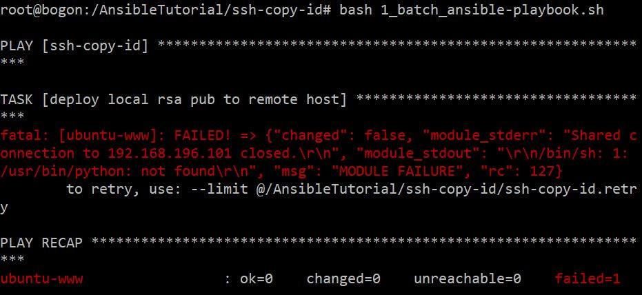
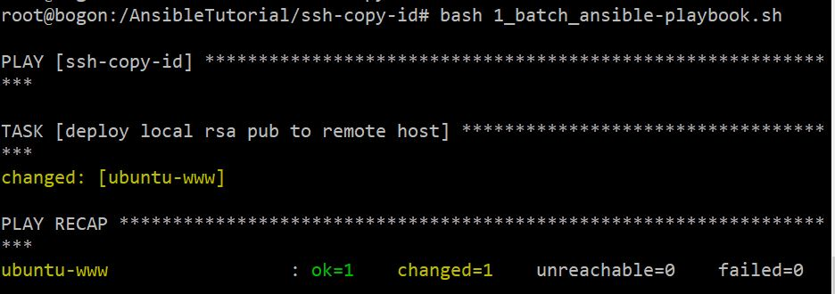
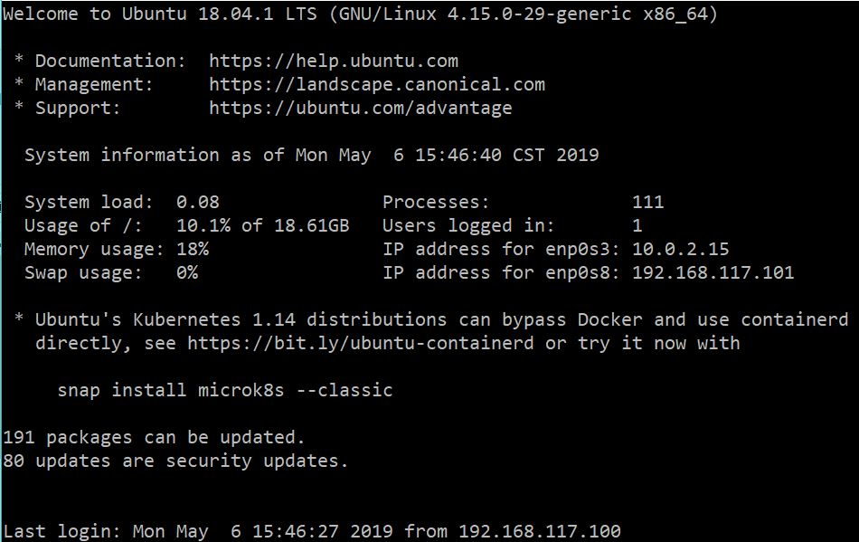
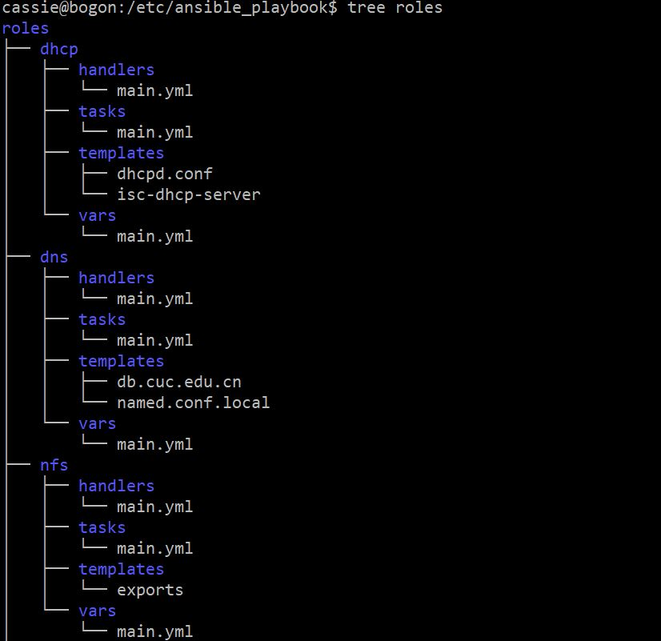
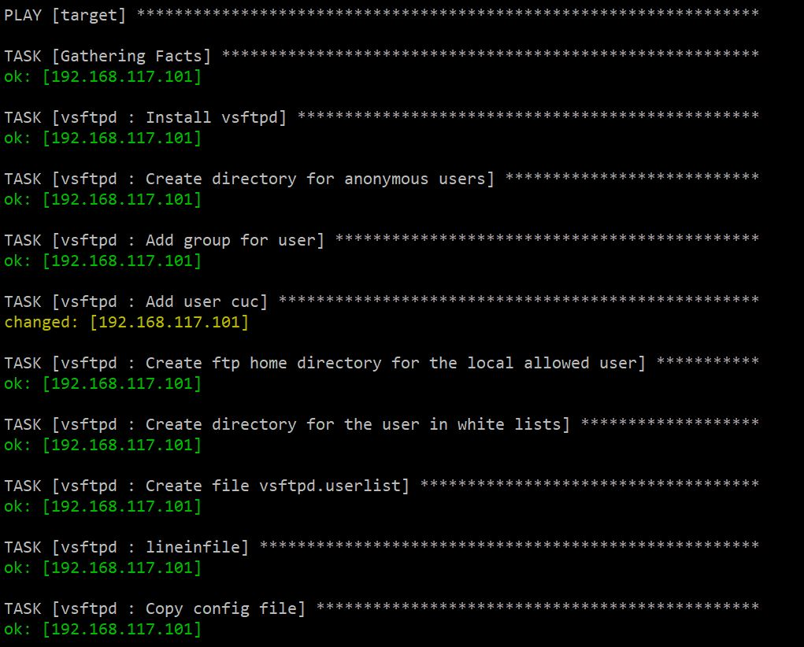
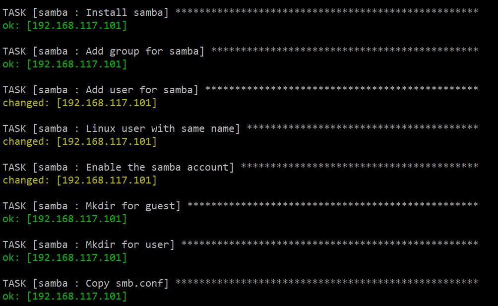
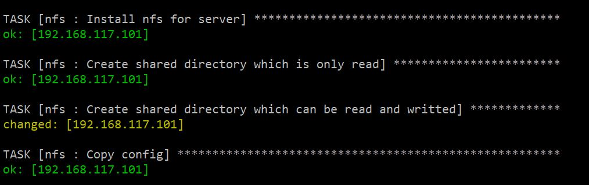
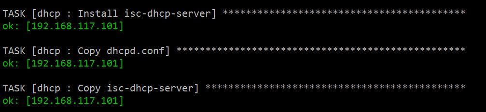
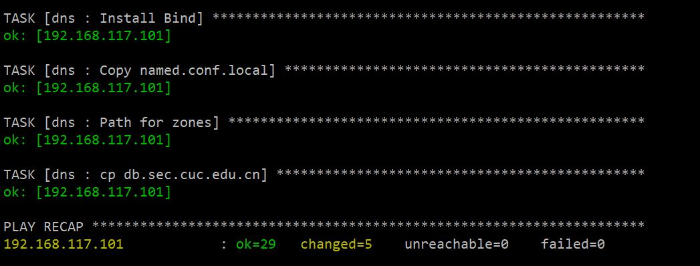

## 实验七
### 环境配置
**ansible_ubuntu18.04：**
- Ubuntu18.04
- Ansible
- IP：192.168.117.100

**ToBeInstalled：**
- Ubuntu18.04
- Python2.7.15rc1
- IP：192.168.117.101

### 配置ssh免密登录
```bash
# clone仓库
sudo git clone https://github.com/c4pr1c3/AnsibleTutorial.git

# 进入AnsibleTutorial文件夹
cd AnsibleTutorial

# 切换到root
sudo su

# 进入ssh-copy-id文件夹
cd ssh-copy-id

# 更改hosts文件
sudo vim hosts
```

将hosts文件改为：

```bash
# 改成需要远程配置的主机ip
[ssh-copy-id]
ubuntu-www ansible_ssh_host=192.168.117.101 ansible_ssh_user=cassie  ansible_ssh_port=22 ansible_become_pass="{{ become_pass }}"

[ubuntu]
ubuntu-www
```

保存并退出

```bash
# 生成id_rsa.pub文件
ssh-keygen -b 2048

# 配置0_batch_ssh-copy-id.sh文件
vim 0_batch_ssh-copy-id.sh
```

将0_batch_ssh-copy-id.sh改为：

```bash
# 改成需要远程配置的主机ip
hosts=(
192.168.117.101
)

# 部分操作系统默认配置的 sshd 是禁止 root 用户远程登录的
# 修改为自己的用户名
users=(
"cassie"
)

ports=(
22
)

i=0

for host in "${hosts[@]}";do
  user=${users[$i]}
  ssh-copy-id -i "$HOME/.ssh/id_rsa.pub" "${user}"@${host} -p ${ports[$i]}
  # patch for Ubuntu 16.04 server without python-minimal installed as pre-requisite
  i=$((i+1))
done
```

保存并退出

```bash
# 将ansible_ubuntu18.04生成的公钥拷贝到ToBeInstalled主机的普通用户的.ssh目录下
bash 0_batch_ssh-copy-id.sh

# 配置ssh-copy-id.yml，将ToBeInstalled主机普通用户.ssh目录下的authorized_keys拷贝到root用户相应目录下
# 改为自己的密码
vim group_vars/ssh-copy-id.yml

# 执行playbook
bash 1_batch_ansible-playbook.sh

# 此时出现错误
```



这是因为ToBeInstalled上未安装python，执行```sudo apt install python-minimal```，安装后成功



```bash
# 此时可以远程登录ToBeInstalled主机
ssh cassie@192.168.117.101
```



### 安装并配置Ansible
```bash
sudo apt update

# 安装ansible
sudo apt install ansible

# sudo vim etc/ansible/hosts
[target]
192.168.117.101

# 配置roles
sudo mkdir -pv ansible_playbook/roles/{vsftpd,nfs,dhcp,dns,samba}/{tasks,files,templates,meta,handlers,vars}

# 列出roles结构
tree roles
```

roles文件总览：




在/etc/ansible_playbook中，创建playbook.yml

[PlayBook剧本](ansible_playbook/playbook.yml)

[dhcp_tasks](ansible_playbook/roles/dhcp/tasks/main.yml)

[dns_tasks](ansible_playbook/roles/dns/tasks/main.yml)

[nfs_tasks](ansible_playbook/roles/nfs/tasks/main.yml)

[samba_tasks](ansible_playbook/roles/samba/tasks/main.yml)

[vsftpd_tasks](ansible_playbook/roles/vsftpd/tasks/main.yml)

```bash
# 执行playbook
sudo ansible-playbook playbook.yml
```











### 实验问题
在实验过程中，出现了putty连接虚拟机"Network error：Connection refused"情况，后发现本机的ip地址（突然地）与host-only的虚拟机ip不在同一网段了，最后在虚拟机全局网络设置中重新建了一个网卡适配器解决。

### 参考链接
- [2015-linux-public-JuliBeacon](https://github.com/CUCCS/2015-linux-public-JuliBeacon/blob/fc0d8c642a7918f0d77665acc95f59287f85373d/%E5%AE%9E%E9%AA%8C%207/%E5%AE%9E%E9%AA%8C7.md)
- [自动化运维工具Ansible安装使用详解](https://www.linuxidc.com/Linux/2017-05/143593.htm)
- [非常好的Ansible入门教程](https://blog.csdn.net/pushiqiang/article/details/78126063)
- [使用putty连接Ubuntu14.04虚拟机失败解决办法](https://blog.csdn.net/wangqingchuan92/article/details/53727001)