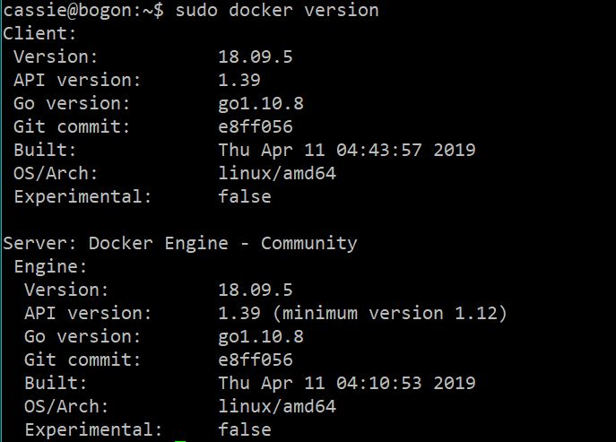
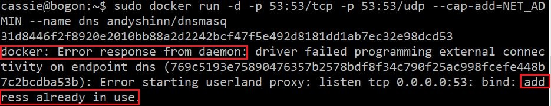
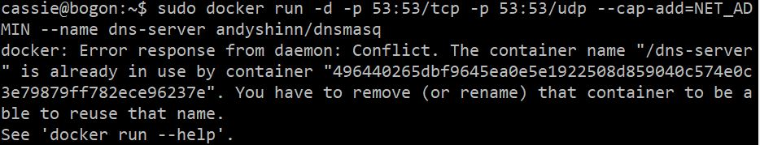
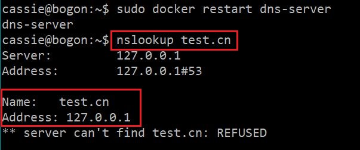
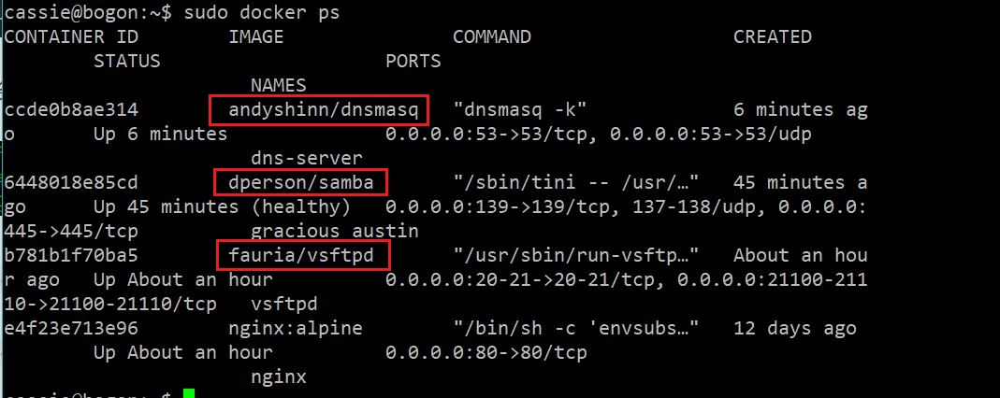

## 实验八
### 实验环境
**docker_ubuntu18.04：**
- docker
- IP：192.168.117.101

版本信息：



### 安装vsftpd
```bash
# 拉取vsftpd镜像
sudo docker pull fauria/vsftpd

# 使用自定义用户帐户创建容器
# -p：将容器内部使用的网络端口映射到主机上
docker run -d -v /my/data/directory:/home/vsftpd \
-p 20:20 -p 21:21 -p 21100-21110:21100-21110 \
-e FTP_USER=myuser -e FTP_PASS=mypass \
-e PASV_ADDRESS=127.0.0.1 -e PASV_MIN_PORT=21100 -e PASV_MAX_PORT=21110 \
--name vsftpd --restart=always fauria/vsftpd

# 手动将新FTP用户添加到现有容器
# -t：在新容器内指定一个伪终端或终端
# -i：允许对容器内的标准输入进行交互
docker exec -i -t vsftpd bash
mkdir /home/vsftpd/myuser
echo -e "myuser\nmypass" >> /etc/vsftpd/virtual_users.txt
/usr/bin/db_load -T -t hash -f /etc/vsftpd/virtual_users.txt /etc/vsftpd/virtual_users.db
exit
docker restart vsftpd
```

### 安装samba
```bash
# 拉取samba镜像
sudo docker pull dperson/samba

# 创建容器
sudo docker run -it -p 139:139 -p 445:445 -d dperson/samba

# 创建用户和共享
sudo docker run -it -p 139:139 -p 445:445 -d dperson/samba \
            -u "example1;badpass" \
            -u "example2;badpass" \
            -s "public;/share" \
            -s "users;/srv;no;no;no;example1,example2" \
            -s "example1 private share;/example1;no;no;no;example1" \
            -s "example2 private share;/example2;no;no;no;example2"
```

### 安装dns
```bash
# 拉取dns镜像
sudo docker pull andyshinn/dnsmasq

# 创建容器
sudo docker run -d -p 53:53/tcp -p 53:53/udp --cap-add=NET_ADMIN --name dns andyshinn/dnsmasq

# 此时出现错误
# 因为ubuntu系统默认安装dnsmasq-base服务
```



```bash
# 关闭服务
# 删除resolv.conf文件
sudo systemctl disable systemd-resolved.service
sudo service systemd-resolved stop
sudo rm /etc/resolv.conf

# 再次创建容器，发现容器已被占用
```



```bash
# 将占用的容器移除
sudo docker rm 496440265dbf9645ea0e5e1922508d859040c574e0c3e79879ff782ece96237e

# 重新创建容器，成功
sudo docker run -d -p 53:53/tcp -p 53:53/udp --cap-add=NET_ADMIN --name dns andyshinn/dnsmasq

# 进入容器
docker exec -it dns-server /bin/sh

# 在/etc 目录下创建resolv.dnsmasq文件
vi /etc/resolv.dnsmasq

# 配置内容
server=114.114.114.114
server=8.8.8.8

# 配置DNS域名解析规则
# 在/etc目录下创建dnsmasq.hosts文件
vi /etc/dnsmasq.hosts

# 添加内容如
127.0.0.1 test.cn

# 打开etc下的dnsmasq.conf配置文件
vi /etc/dnsmasq.conf

# 在文件最后添加自定义的配置文件
resolv-file=/etc/resolv.dnsmasq
addn-hosts=/etc/dnsmasq.hosts

# 退出并重启容器
exit
sudo docker restart dns-server

# 域名解析成功
nslookup test.cn
```





### 实验问题
由于在安装dns时关掉了ubuntu自带的systemd-resolved服务，而且删除了```/etc/resolv.conf```文件，但是每次虚拟机重启之后，系统会自动生成```resolv.conf```文件，会导致系统会解析不了外部域名而上不了网。可以通过编辑/etc/resolv.conf文件且给该文件上锁

```bash
# 编辑/etc/resolv.conf文件
sudo vi /etc/resolv.conf

# 添加内容
nameserver 虚拟机dns服务地址

# 上锁
sudo chattr +i /etc/resolv.conf

# 解锁
sudo chattr -i /etc/resolv.conf
```

### 参考链接
- [fauria/docker-vsftpd](https://github.com/fauria/docker-vsftpd)
- [dperson/samba](https://github.com/dperson/samba)
- [docker下安装dnsmasq时53端口被占用的解决办法](https://blog.csdn.net/qq_34092609/article/details/87184163)