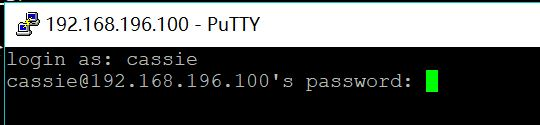
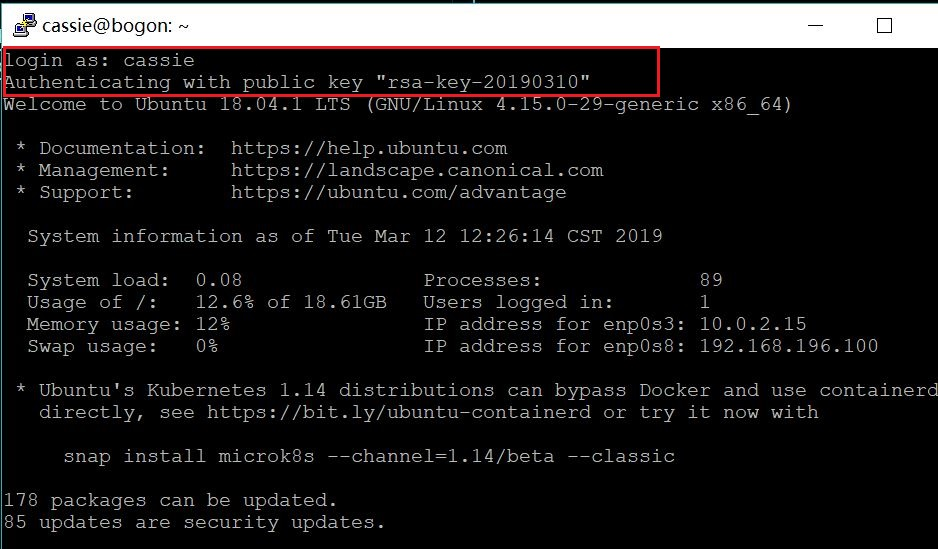
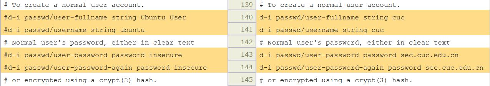

## 实验一
### 实验要求
- 如何配置无人值守安装iso并在Virtualbox中完成自动化安装。
- Virtualbox安装完Ubuntu之后新添加的网卡如何实现系统开机自动启用和自动获取IP？
- 如何使用sftp在虚拟机和宿主机之间传输文件？

### 实验环境
Virtualbox虚拟机：linux ubuntu 18.04.1-server

网络设置：
- NAT：10.0.2.15/24
- Host-Only：192.168.196.100/24

### 实验过程
**一、在Virtualbox中使用多重加载的方式安装ubuntu 18.04.1-server**

**二、为该虚拟机添加第二块```Host-Only```模式的网卡，实现系统开机自动启用和自动获取IP：**
- 打开并编辑配置文件：
```vim /etc/netplan/01-netcfg.yaml```
- 将文件更改为：
```txt
network:
  version: 2
  renderer: networkd
  ethernets:
    enp0s3:
      dhcp4: yes
    enp0s8:
      dhcp4: yes  
```
- 应用改变后的配置文件：
```sudo netplan apply```


**三、宿主机putty ssh免密登录虚拟机：**
- 在虚拟机中安装ssh：
```sudo apt install ssh```
- 使用用户名和密码登录虚拟机：



- 在```PuTTY Key Generator```中生成公私钥对


- 保存生成的公钥：
```txt
ssh-rsa AAAAB3NzaC1yc2EAAAABJQAAAQEAkqLYxePRNhcTnFpw9f3L4lMIeMJwQXXLe//8lWrrbHI9GBbkkP+NxRyX9KFL7Pe0j+i3JzZFE29jYBPhOcLsRGW53v5MwipkE9LJ6g7SNJ4q5k/lu1lIjpKL9OZqDD+0MOcjUoIjrhh64Z1jWYDzTAk0GwPgEYqO0NsusSJzId1BpjNBPCU2fWOA46XjCNVRfEfcsuAX5V50gW8S3Go+YrODmL9RZxlf/3PsAqQoi+8SVAxRe7I3WRwtqmUBbfMPF0YB243x5vsNk5MkB1+xAEMAQ7QTM2Dw6WAQWVv9dlHbDCj7SvRUn2M3pd9BddZm0qRJEpdHwv/sDygPr1bmRQ== rsa-key-20190310
```
- 打开文件```vim ~/.ssh/authorized_keys```，将生成的公钥粘贴到文件中并保存
- 在putty中添加私钥文件


- 此时，使用ssh登录虚拟机将不需要输入密码：



**四、创建无人值守镜像：**
- 首先通过```有人值守```的方式安装好一个可用的Ubuntu系统环境，即本次实验的虚拟机。
- 将镜像下载到虚拟机中：```wget http://old-releases.ubuntu.com/releases/18.04.0/ubuntu-18.04.1-server-amd64.iso```
- 在当前用户目录下创建一个用于挂载iso镜像文件的目录：```mkdir loopdir```
- 挂载iso镜像文件到该目录：```sudo mount -o loop ubuntu-18.04.1-server-amd64.iso loopdir```
- 创建一个工作目录用于克隆光盘内容：```mkdir cd```
- 同步光盘内容到目标工作目录：```rsync -av loopdir/ cd```
- 卸载iso镜像：```sudo umount loopdir```
- 进入目标工作目录：```cd cd/```
- 编辑Ubuntu安装引导界面增加一个新菜单项入口：```vim isolinux/txt.cfg```
- 将以下内容添加到txt.cfg中然后强制保存退出：
```txt
label autoinstall
   menu label ^Auto Install Ubuntu Server
   kernel /install/vmlinuz
   append  file=/cdrom/preseed/ubuntu-server-autoinstall.seed debian-installer/locale=en_US console-setup/layoutcode=us keyboard-configuration/layoutcode=us console-setup/ask_detect=false localechooser/translation/warn-light=true localechoosertranslation/warn-severe=true initrd=/install/initrd.gz root=/dev/ram rw quiet
```
- 将定制好的种子文件命名为ubuntu-server-autoinstall.seed并上传至preseed文件夹里：```~/cd/preseed/ubuntu-server-autoinstall.seed```


- 修改isolinux/isolinux.cfg，修改内容```timeout 10```：


- 重新生成md5sum.txt：```cd ~/cd && find . -type f -print0 | xargs -0 md5sum > md5sum.txt```


  
- 重新封装为custom.iso：
```txt
IMAGE=custom.iso
BUILD=~/cd/

mkisofs -r -V "Custom Ubuntu Install CD" \
           -cache-inodes \
           -J -l -b isolinux/isolinux.bin \
           -c isolinux/boot.cat -no-emul-boot \
           -boot-load-size 4 -boot-info-table \
           -o $IMAGE $BUILD
```


**五、利用sftp将镜像文件从虚拟机传到主机：**

```txt
sftp cassie@192.168.196.100
get /home/cassie/cd/custom.iso
```


- 可以看到，```custom.iso```已经被下载到本地：


### 实验结果

[无人值守镜像自动安装](https://v.youku.com/v_show/id_XNDA5NTA1MDk0OA==.html?spm=a2hzp.8244740.0.0)

### 实验思考

**利用[在线文本比较工具](http://tools.jb51.net/aideddesign/txt_diff#diff)对官方文档和定制文档进行比对**

结果如下：（左侧为官方文档，右侧为定制文档）

- 预置地点，跳过语言问询


- 减少链接等待超时的时长


- 减少dhcp等待超时的时长


- 不允许自动配置网络


- 配置网卡:


- 设置默认主机名和域名，强制设置主机名为```isc-vm-host```：


- 设置用户名为```cuc```，密码与确认密码为```sec.cuc.edu.cn```：



- 设置时区为亚洲/上海：


- 并关闭ntp时钟设置：


- 对最大空闲空间分区进行自动分区：


- 使用lvm对磁盘进行分区，选择最大的逻辑卷组，并选择分区方案为```multi: separate /home, /var, and /tmp partitions```：


- 不使用网络镜像：


- 选择安装server软件包：


- 安装openssh-server：


- 禁止自动升级软件包：


- 更新策略为自动升级：


### 参考链接
- [使用sftp下载文件](https://blog.csdn.net/aa453205586/article/details/72730060)
- [genisoimage: Permission denied. Unable to open disc image file 'xxx.iso'的原因](https://forum.ubuntu.org.cn/viewtopic.php?t=318993)